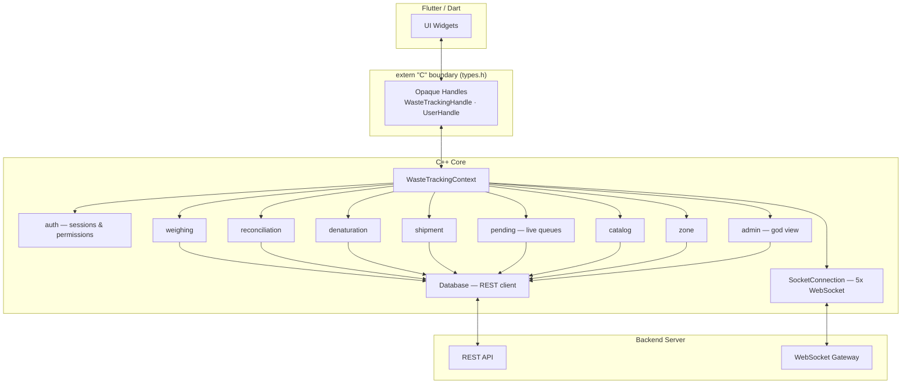
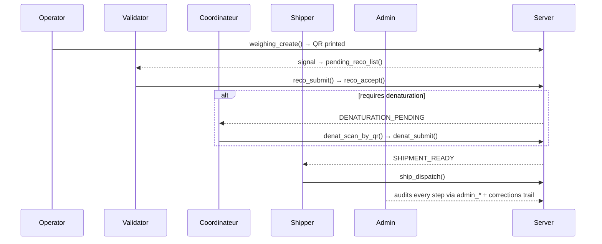

# Waste Tracking FFI Core

**A native C++ engine that powers a real-time, audit-compliant industrial waste-tracking system — exposed to a Flutter desktop app through a hand-rolled FFI layer.**

[](#)
[](#)
[](#)
[](#)
[](#license)

> Built to track pharmaceutical waste from the scale on the factory floor all the way through validation, chemical denaturation, and shipment — with a full audit trail at every step.

---

## Why this project exists

Most CRUD apps stop at "save to database." This one had to survive a real factory floor: multiple roles working in parallel, live QR-scan hardware, a server that pushes events instead of waiting to be polled, and a compliance requirement (ALCOA+ style data integrity) where **nothing is ever silently overwritten** — every correction is logged, flagged, and reviewable.

This isn't a tutorial clone or a toy CRUD app — it runs against real weighing hardware, real QR scanners, and a live multi-role factory workflow, with a compliance model (ALCOA+ style data integrity) that doesn't forgive shortcuts. It was built and deployed in an actual industrial environment, not just demoed on a laptop.

---

## Architecture



### The "chamber" pattern

Each business domain is a self-contained pair of files (`x.h` / `x.cpp`) exposing its own `extern "C"` surface. No chamber reaches into another's internals — they only share the root `WasteTrackingContext`.

| Chamber | Responsibility |
|---|---|
| `context` | Root object — owns the `Database`, `AuthManager`, and `SocketConnection`; holds server config |
| `auth` | Login, session lifecycle, role-based permission checks |
| `weighing` | Origin of every batch — operator records gross/tare, server computes net + issues QR |
| `reconciliation` | Validator re-weighs and accepts/rejects each batch |
| `denaturation` | Chemical stabilization step for material types that require it, before shipment can unblock |
| `shipment` | Final dispatch — blocked server-side until denaturation is complete |
| `pending` | Live "what needs doing right now" queue, scoped per role |
| `catalog` | Reference data — material types and products |
| `zone` | Storage zone reference data |
| `admin` | Cross-cutting reads, session management, corrections audit trail, full export |
| `socket_connection` | Owns 5 concurrent WebSockets: signals, heartbeat, and 3 independent QR-scan bridges |
| `database` | HTTP client wrapping every REST call (`httplib`), one method per endpoint |

---

## Design patterns worth reading the code for

**1. Opaque handle FFI**
`WasteTrackingHandle`, `UserHandle`, etc. are `void*` — Dart never sees a C++ type, so the ABI stays stable even as internals change.

**2. Consistent memory contract**
Every heap-allocated string returned across the FFI boundary has a matching chamber-scoped free function (`weighing_free_string`, `admin_free_string`, …). Dart never calls `free()` directly — ownership rules are explicit and impossible to mix up between chambers.

**3. Layered permission gating**
Every mutating call resolves the caller's session and calls `checkPermission(user_handle, "permission_name")`, which returns one of `OK / NO_SESSION / SESSION_DEAD / ROLE_DENIED` — mapped consistently to typed `WasteTrackingError` values across all 10+ chambers.

**4. Real-time signal fan-out**
The server pushes a single `WORKFLOW_SIGNAL` envelope over one WebSocket. `SocketConnection::dispatchSignal()` reads the category and routes it to the correct chamber's `notify_*()`, which fires the Dart callback registered at login (`NativeCallable.permanent()`). One socket, many typed listeners — no chamber owns more transport logic than it needs.

**5. Audit-first mutations**
Corrections don't overwrite data — they log to a corrections table, flag the record, and emit a signal so admin sees it. Nothing about a waste batch's history disappears.

---

## Workflow



---

## Tech stack

- **C++17/20** — core business logic
- **[nlohmann/json](https://github.com/nlohmann/json)** — JSON handling across the REST and WebSocket boundaries
- **[httplib](https://github.com/yhirose/cpp-httplib)** — header-only HTTP client
- **[IXWebSocket](https://github.com/machinezone/IXWebSocket)** — WebSocket client for real-time signals, heartbeat, and QR bridges
- **Dart FFI** — consumer side, driving a Flutter desktop UI

---

## Getting started

> These are the general steps — adjust paths/flags to match your local toolchain.

```bash
git clone https://github.com/<your-username>/<repo-name>.git
cd <repo-name>

# Build the shared library
mkdir build && cd build
cmake ..
cmake --build .
```

The output is a shared library (`.so` / `.dll` / `.dylib`) that a Flutter app loads via `dart:ffi`, binding against the C API declared in each `*.h` file (see `types.h` for the shared handle/callback typedefs every chamber builds on).

---

## Project structure

```
.
├── context.{h,cpp}          # Root object, server config
├── auth.{h,cpp}              # Sessions & permissions
├── weighing.{h,cpp}           # Batch origin
├── reconciliation.{h,cpp}     # Validator workflow
├── denaturation.{h,cpp}       # Chemical stabilization
├── shipment.{h,cpp}           # Dispatch
├── pending.{h,cpp}            # Live per-role queues
├── catalog.{h,cpp}            # Material types & products
├── zone.{h,cpp}                # Storage zones
├── admin.{h,cpp}               # God view / audit
├── socket_connection.{h,cpp}  # Real-time transport
├── database.{h,cpp}            # REST client
└── types.h                     # Shared FFI contract
```

---

## About the developer

Built by **Mohamed Amine** — Bachelor's in Computer Science (Computer Systems) from the University of Blida 1, currently pursuing a Master's in Artificial Intelligence. Background in C++ and systems-level engineering,

- [LinkedIn](https://www.linkedin.com/in/mohamed-amine-mammar-el-hadj-715a41295)

